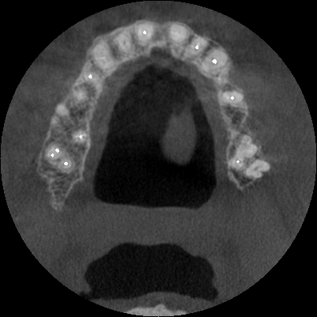
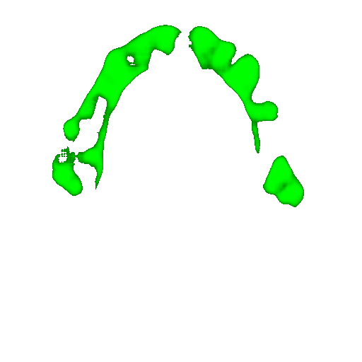
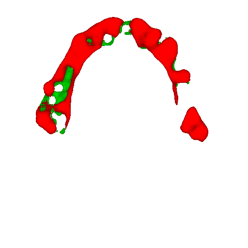
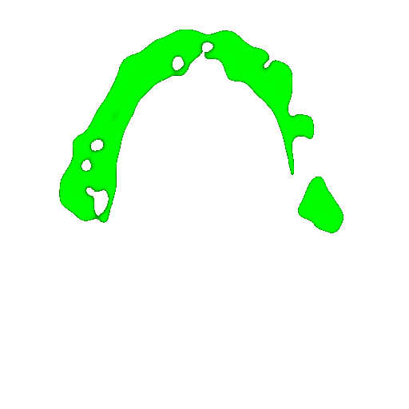
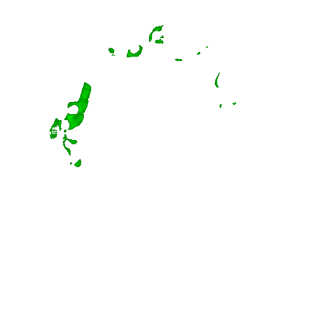

# Membrans
This is some scripts for preparing image data, augmentations, training neural networks - U-Net, VAE at now, and saving their results as images on disk.

Results:

Orig:

Mask:

Different colors results of VAE:

One color results of VAE:

Generated membran:

As you can see, result of VAE doesn't valuable. The main reason is low amount of data for learning for this project

Other architecture of second NN may give better results, so it can be improved